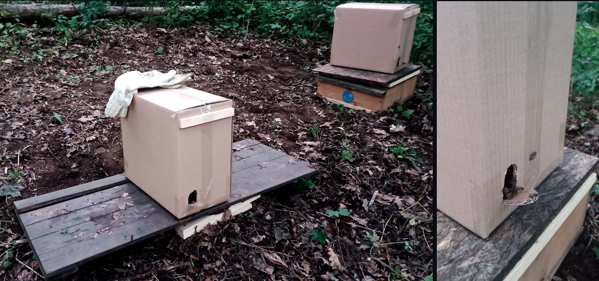

# Bee Farm 🍯🐝

Včelaření je v naší rodině dlouholetou tradicí. Již můj praděda se zabýval včelařením od svého mládí až do svých posledních dnů. Bohužel já pocházím z větve, která již druhou generaci žije ve velkoměstě a tak jsem vyrostl v bytovém domě, kde nebyla žádná zvířata. Kromě psů, koček a drobných hlodavců. To se změnilo v roce 2016, kdy jsem se rozhodl vrátit ke kořenům.

    
        

            <b>Fig.1 - Current status (Oct 2022)</b>
        

Prvním krokem byl vstup do včelařské skupiny pro začínající hobby včelaře, kde jsem se naučil základní zootechnické postupy. V této době jsem neměl vlastní úly a staral jsem se o včelastva patřící skupině. V roce 2021 jsem se rozhodl osamostatnit a na pronajatém lesním pozemku na okraji města jsem začal budovat vlastní včelí minifarmu. Na začátku jsem tu umístil dvě mladá včelstva. Na obrázcích 2 a 3 je vidět podoba včelnice první den pro vysazení včelstev. Včelstva jsou stále umístěna v přepravních krabicích a na improvizovaných platformách. 

    
        

            <b>Fig.2,3 - Deployment (15th July 2021)</b>
        

Po zimě 21/22 následovalo drobné zklamání. Jedno včelstvo uhynylo. Avšak druhé včelstvo bylo velmi silné. Přebytek včel a plodu byl použit pro vytvoření dvou základů nových včelstev.

    
        

            <b>Fig.4 - Farm before extension (July 2022)</b>
        

## Build a New Wooden Bench

Protože zelená a žlutá platforma vznikly jako improvizované řešení a umožňují umístění pouze jednoho úlu na každou platformu, padlo rozhodnutí vyrobit novou kvalitnější platformu s dostatečnou tuhostí konstrukce a kapacitou 4 až pět úlů. Finální návrh je jednoduchá konstrukce připomínající žebřík, která je umístěna na tři stavební cihly. Dřevěná část je vyrobena ze smrkového dřeba. Povrch je ošetřen olejovou barvou jako ochrana proti povětrnostním vlivům. Jednotlivé části jsou spojeny kolíky a vruty do dřeva.

    
    
        

            <b>Fig.5,6 - Wooden beam 100x100-2500 mm</b>
        

Dřevěné trámy jsou nařezané na potřebné rozměry přímo u prodejce. Následné opracování probíhalo v domácích podmínkách a to včetně lakování olejovou barvou na dřevo.

    
        

            <b>Fig.5 - 
Drilling holes for screws </b>
        

    
        

            <b>Fig.6 - Making dimples for precise drilling holes for pins </b>
        

Na obrázku níže je zobrazena sestavy dřevěné konstrukce. Zde máme vzácnou možnost vidět onu sestavu z opačné strany, kde si můžeme povšimnout děr pro napojení na závitové týče. V levé dolní části obrázku se nachází jedna z podpůrných cihel, které jsou osazeny závitovými tyčemi. 

    
        

            <b>Fig. 7 - Under construction</b>
        

