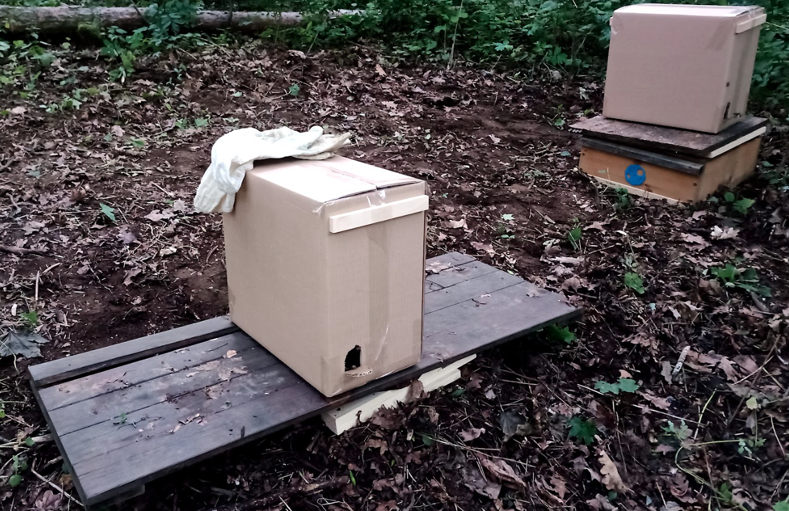
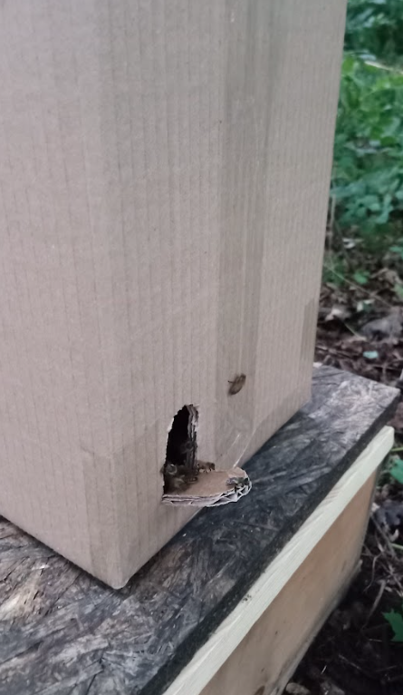
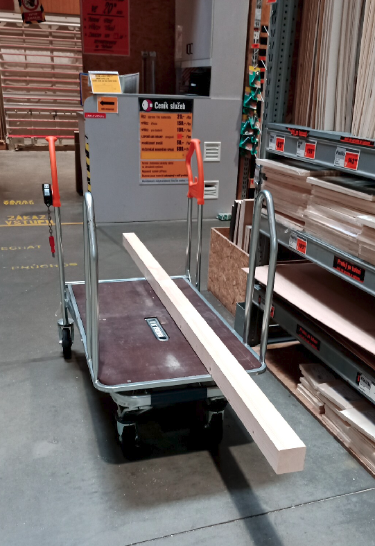
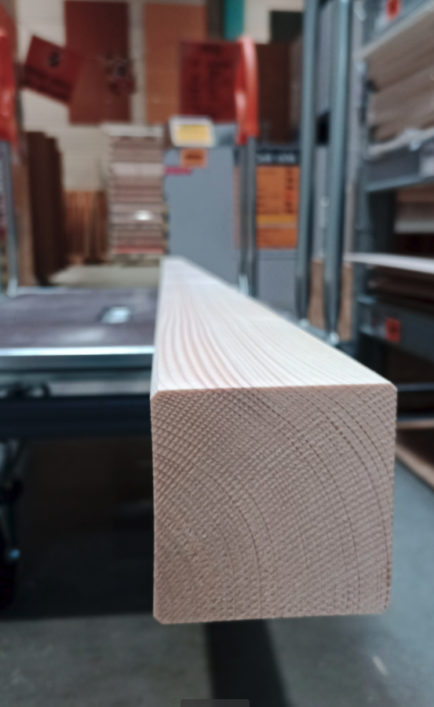
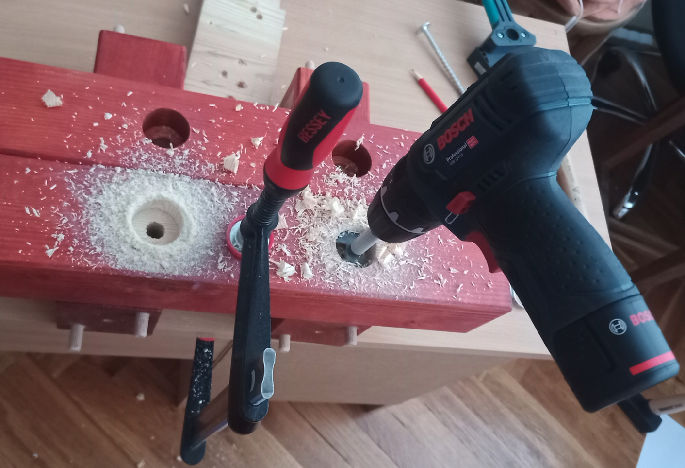
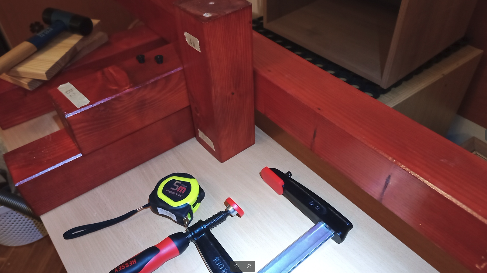
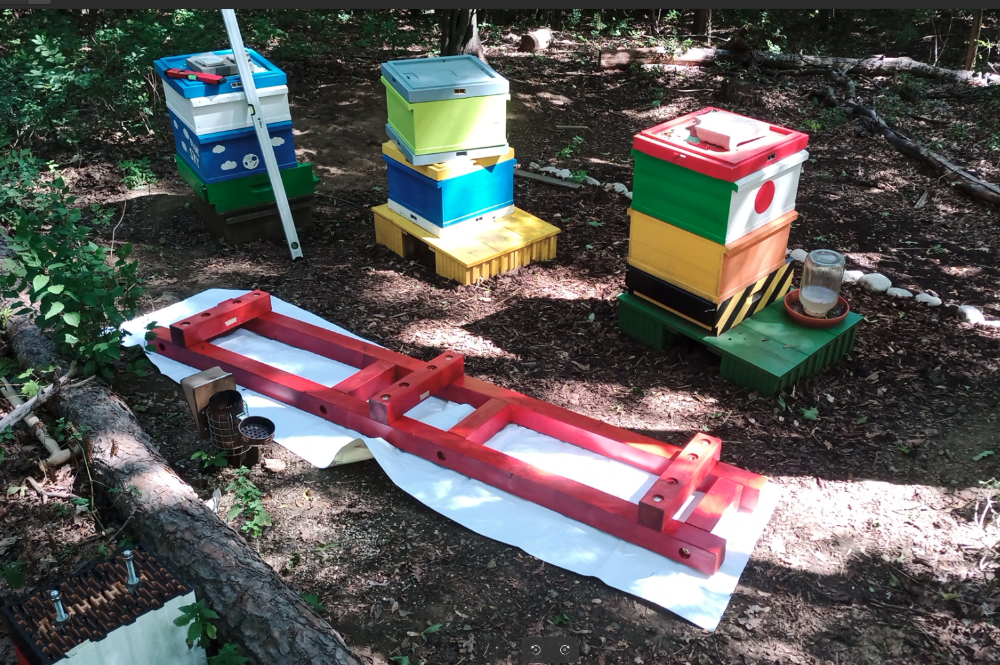

# Bee Farm 🍯🐝

The beekeeping is a long-standing tradition in my family. My great-grandfather was engaged in beekeeping from his youth until his last days. Unfortunately, I come from a branch that has been living in the big city for the second generation. So I grew up in an apartment building where there were no animals. Except for dogs, cats and small rodents. That changed in 2016 when I decided to go back to my roots.

    
        

            <b>Fig.1 - Current status (Oct 2022)</b>
        

The first step was joining a beekeeping group for beginner hobby beekeepers where I learned basic zootechnical procedures. At this time I did not have my own hives and I was looking after the bee colonies belonging to the group. In 2021, I decided to become independent and started to build my own mini-bee farm on a rented forest plot on the outskirts of the city. At the beginning, I placed two young bee colonies here. Pictures 2 and 3 show the appearance of the beehive on the first day of planting bee colonies. Apiaries are still housed in shipping boxes and on improvised platforms.

    
    
        

            <b>Fig.2,3 - Deployment (15th July 2021)</b>
        

The winter of 21/22 was followed by a minor disappointment. One bee colony died. However, the second colony was very strong and suitable for collecting excess bees and brood to create new colonies.

    
        

            <b>Fig.4 - Farm before extension (July 2022)</b>
        

## Build a New Wooden Bench

Since the green and yellow platforms were created as an improvised asap solution and allow the placement of only one hive on each platform, the decision was made to produce a new, higher quality platform with sufficient structural rigidity and a capacity of four to five hives. The final design is a simple structure resembling a ladder. That assy is placed on three building blocks. The wooden part is made from spruce wood. The surface is treated with oil paint as protection against weathering. Individual parts are connected by pins and wood screws.

    
    
        

            <b>Fig.5,6 - Wooden beam 100x100-2500 mm</b>
        

I had the wooden beams cut to the required dimensions directly at the seller. Subsequently, I treated them at home and provided them with a protective coating.

    
        

            <b>Fig.5 -
Drilling holes for screws </b>
        

    
        

            <b>Fig.6 - Making dimples for precise drilling holes for pins </b>
        

The picture below shows the assembly of the wooden structure. Here we have a rare opportunity to see that assembly from the opposite side where we can notice the holes for the connection to the threaded part. In the lower left part of the picture there is one of the supporting blocks which are fitted with threaded rods.

    
        

            <b>Fig. 7 - Under construction</b>
        

