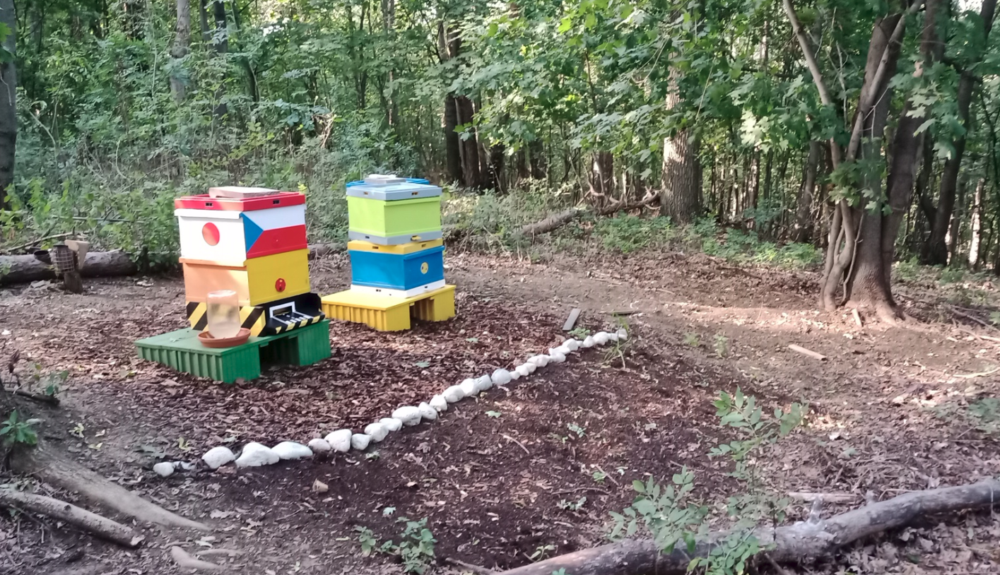

# Bee Farm 🍯🐝
Beekeeping is tradional actvity for 

Včelaření je v naší rodině dlouholetou tradicí. Již můj praděda se zabýval včelařením od svého mládí až do svých posledních dnů. Bohužel já pocházím z větve, která již druhou generaci žije ve velkoměstě a tak jsem vyrostl v bytovém domě, kde nebyla žádná zvířata. Kromě psů, koček a drobných hlodavců. To se změnilo v roce 2016, kdy jsem se rozhodl vrátit ke kořenům.

<figcaption align = "center"><b>Fig.1 - Current status (Oct 2022)</b></figcaption>

První krokem byl vstup do včelařské skupiny pro začínající hobby včelaře, kde jsem se naučil základní zootechnické postupy. V této době jsem neměl vlastní úly a staral jsem se o včelastva patřící skupině. V roce 2021 jsem se rozhodl osamostatnit a na pronajatém lesním pozemku na okraji města jsem začal budovat vlastní včelí minifarmu. Na začátku jsem tu umístil dvě mladá včelstva.

<figcaption align = "center"><b>Fig.1 - Current status (Oct 2022)</b></figcaption>

